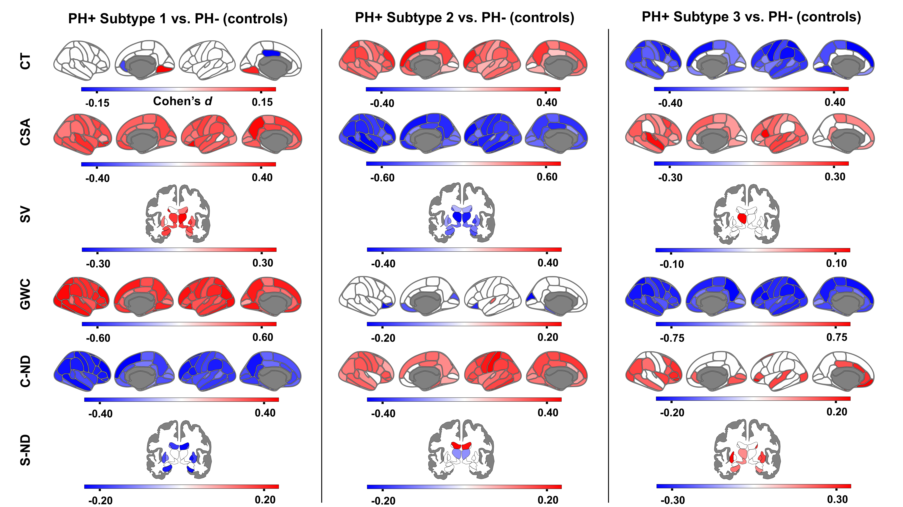
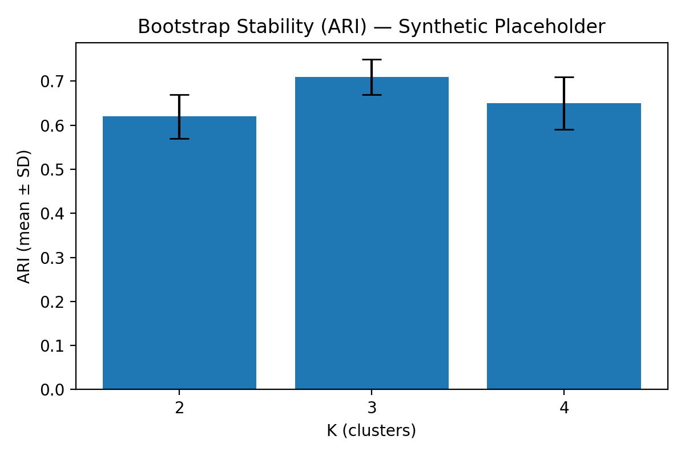

# Brain-Based Risk Stratification for Precision Psychiatry
## A DUA-safe, reproducible mini-slice from my MSc manuscript with stability and explainability

<p align="center">
  <a href="#from-manuscript--deployable-slice">📄 Manuscript → demo</a> ·
  <a href="#quickstart-5-minutes">⏱️ 5-minute demo</a> ·
  <a href="#repo-map-whats-here">🌳 Repo map</a> ·
  <a href="#demo-outputs-saved-files">📊 Outputs</a> ·
  <a href="./NOTICE">🔒 Compliance</a>
</p>

**Why this exists.** This repo turns my MSc manuscript on brain-based subtyping of asymptomatic high-risk youth (ABCD Study) into a **DUA-safe, production-respectful mini-slice**: one-command demos, stability metrics, and explainable baselines that a clinical team could adapt to their private data tomorrow.

> **Clinical framing (a 60-sec take):**
> HYDRA finds **three neurodevelopmental subtypes** among PH⁺ youth (no baseline diagnoses):
> 1) **Delayed Maturation — Escalating Risk**
> 2) **Atypical Maturation — Latent Vulnerability**
> 3) **Accelerated Maturation — Resilient Profile**
> This repo shows how to operationalize stratified monitoring with **reproducible runs**, **stability**, and **transparent signals**.

---

## Visual Overview

> Manuscript evidence on top row; reproducible demo outputs below. Captions in [`figures/LEGENDS.md`](figures/LEGENDS.md). Provenance in [`FIGURES_SOURCES.md`](FIGURES_SOURCES.md).

<table>
<tr>
<td width="50%" align="center">

<br/>
<em>Manuscript (fig. 4): Regional neuroimaging signatures (aggregate)</em>

</td>
<td width="50%" align="center">

<br/>
<em>Manuscript (fig. 5): CBCL trajectories (aggregate)</em>

</td>
</tr>
<tr>
<td width="50%" align="center">

<br/>
<em>Demo: Bootstrap stability (ARI)</em>

</td>
<td width="50%" align="center">

<br/>
<em>Demo: Explainability (top-10 features)</em>

</td>
</tr>
</table>

---

### Why it matters
- **Precision prevention, not hype:** honest stability checks (ARI, bootstrap) and clear effect sizes.
- **Reproducible by design:** Makefile, pinned deps, seeds, tiny tests, deterministic synthetic data.
- **Privacy-first posture:** **no ABCD subject-level artifacts**; synthetic/open-proxy demos only.

---

### DUA/Compliance banner
- ✅ **Present** here: manuscript text/figures (aggregate), synthetic demo data, code skeletons, configs that point to **local/private** paths.
- ⛔ **Absent**: ABCD subject-level data, per-subject predictions/cluster IDs, ABCD-trained weights/hyperplanes, site harmonization params.
- See **[COMPLIANCE.md](./COMPLIANCE.md)** for red lines and automated leak checks.

---

## Quickstart (5 minutes)

```bash
# one-time on a fresh machine
make setup

# generate deterministic synthetic data
make data

# run HYDRA-style stratification proxy on synthetic data (saves metrics/figures)
make demo_stratify

# run explainable baselines (ridge + small RF) with dummy comparisons + SHAP/permutation
make demo_baselines

# write a tiny clinical-style report with links to saved outputs
make report
```

**Outputs land in** `./figures/` and `./reports/` (screenshots below).

---

## Repo map (what’s here)

```
neuro-stratification-mincred/
├─ README.md                   # you’re here
├─ LICENSE
├─ COMPLIANCE.md               # red lines + examples
├─ figures/                    # thesis & demo figures
├─ paper/                      # thesis link
├─ data/
│  ├─ synthetic/               # seeded demo CSVs
│  └─ README_DATA.md
├─ configs/
│  ├─ demo_synth.yml
│  └─ abcd_stub.yml            # paths-only wiring pattern for private runs
├─ src/
│  ├─ synthgen/                # FreeSurfer-like ROI + context generator
│  ├─ stratify/                # HYDRA-style proxy + ARI/silhouette + bootstrap
│  ├─ baselines/               # ridge + RF + dummy + SHAP/permutation
│  ├─ eval/                    # metrics, effect sizes, tiny report writer
│  └─ viz/                     # stability plot, heatmaps, SHAP bar
├─ cli.py
├─ Makefile
└─ tests/
   ├─ test_synth_shapes.py
   ├─ test_cli_smoke.py
   └─ test_dua_guard.py
```

---

## From Manuscript → Deployable Slice

```
[MSc Manuscript]
  • HYDRA subtypes (3)
  • Stability via ARI
  • Imaging signatures + effect sizes
  • CBCL trajectories (aggregate)
         │
         ▼
[This Repo]
  ┌───────────────────────────────────────────────────────────┐
  │ CLI + Makefile  →  deterministic demos                    │
  │ synthgen/       →  seeded FreeSurfer-like features        │
  │ stratify/       →  reference-guided clustering proxy      │
  │ baselines/      →  ridge + RF + dummy + SHAP/permutation  │
  │ eval/ + viz/    →  metrics, bootstrap, figures, mini-report│
  └───────────────────────────────────────────────────────────┘
         │
         ▼
[Clinical Readout]
  • Who to monitor and why
  • Stability & uncertainty surfaced
  • Private data can plug in via config
```

---

## HYDRA-derived subtype cards → “what do we do with this?”

**1) Delayed Maturation — Escalating Risk**
- **Signature:** Larger surface area & subcortical volumes, ↑GWC, ↓neurite density.
- **Context:** Highest baseline symptoms; **worsening internalizing** over 3 years.
- **Actionable readout:** Prioritize **early monitoring** and support; watch internalizing trajectories.

**2) Atypical Maturation — Latent Vulnerability**
- **Signature:** ↑Cortical thickness & neurite density; ↓surface area/volume; socioeconomic adversity.
- **Context:** Elevated baseline symptoms; subset worsens under adversity.
- **Actionable readout:** **Context-aware** monitoring; address **SES/parental supervision** risks.

**3) Accelerated Maturation — Resilient Profile**
- **Signature:** Cortical thinning, expanded surface area, ↓GWC, ↑NDI in regulatory/associative cortices.
- **Context:** Elevated baseline symptoms but **stable** over time; stronger peer networks.
- **Actionable readout:** **Maintain supports**; no escalated clinical watch needed absent new risks.

> Subtype blurbs summarize my manuscript (aggregates only). No subject-level artifacts are present here.

---

## Demo outputs (saved files)
- Stability (ARI + bootstrap): [`figures/fig_stability_ari.png`](figures/fig_stability_ari.png)
- Explainability (top-10 features): [`figures/fig_shap_top10.png`](figures/fig_shap_top10.png)
- Auto-report (clinical-style summary): [`reports/demo_summary.md`](reports/demo_summary.md)

---

## Using your private data safely (internal teams)
- See `./configs/abcd_stub.yml` for the pattern to point to **local, access-controlled** data.
- This public repo does not ship subject-level data or model artifacts derived from ABCD.
- Run the same CLI targets internally; outputs remain inside your environment.

---

## What didn’t work (and why it matters)
- **MINiT/ViT on T1 MRI**: strong train, weak generalization to subtype labels (~0.45 val acc).
- **Takeaway:** Neurite density information is important for subtype differentiation. **Explainable baselines** are preferred until signal is robust.

---

## License & citation
- License: see **[LICENSE](./LICENSE)**.
- If you reference the manuscript, please cite the MSc thesis (link in `/paper/`).
